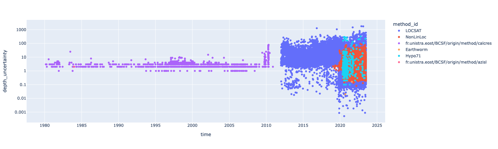
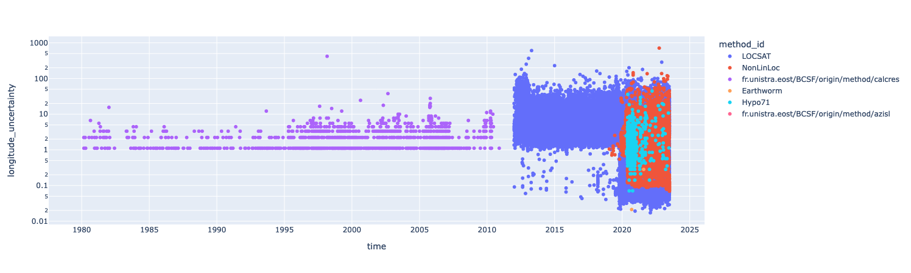

# Introduction

A simple dashboard displaying depth, latitude and longitudes incertainties from our seismic catalog.





# How to use it

## Installation

```bash
pipenv install
```

## Launch

```bash
pipenv shell
python main.py
```
